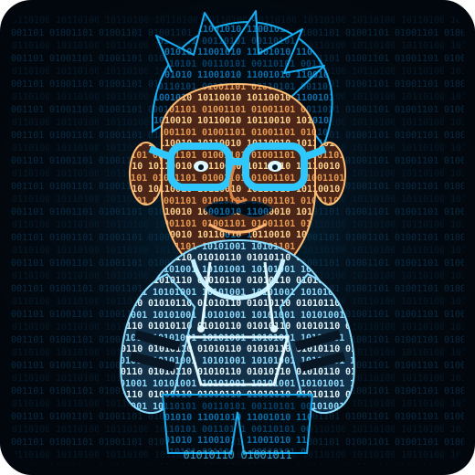

<p align="center">
  
</p>

<p align="center">
  <a href="https://github.com/Venkatakrishnan-Ramesh">
    
  </a>
  <a href="https://www.linkedin.com/in/venkatakrishnan-ramesh-997409214">
    
  </a>
  <a href="https://venkatakrishnanramesh.netlify.app">
    
  </a>
  
</p>

<table>
  <tr>
    <td width="34%" align="center" valign="top">
      
      <h2>Venkatakrishnan Ramesh</h2>
      <p><strong>IT Engineer · QA Engineer · AI Builder</strong></p>
      <p>Bengaluru, India</p>
      <p><em>Building systems that are reliable, measurable, and hard to break.</em></p>
    </td>
    <td width="66%" valign="top">

```javascript
const venkat = {
  role: "IT Associate Engineer — QA",
  company: "Palo Alto Networks",
  focus: [
    "Enterprise automation",
    "CI/CD quality engineering",
    "Cloud security research",
    "LLM evaluation and agentic tooling"
  ],
  stack: {
    languages: ["Python", "C++", "Java", "SQL", "MATLAB"],
    ai_ml: ["PyTorch", "TensorFlow", "scikit-learn", "OpenCV"],
    platform: ["GitHub Actions", "Harness", "SonarQube", "Docker", "Linux"]
  },
  principle: "Code. Test. Measure. Improve."
};
```

> Turning research ideas and messy operational workflows into production-grade systems.

  </td>
  </tr>
</table>

## What I build

- **Quality engineering systems** — CI/CD gates, test automation, release validation, compliance dashboards, and failure analysis.
- **AI and ML products** — NLP, computer vision, representation learning, model evaluation, and workflow automation.
- **Cloud security research** — IAM blast-radius analysis, identity-to-data attack paths, policy validation, and remediation logic.
- **Developer tooling** — bug triage, automated repair loops, multi-agent review, and engineering productivity tools.

## Selected work

<p align="center">
  <a href="https://github.com/Venkatakrishnan-Ramesh/OperationalML">
    
  </a>
  <a href="https://github.com/Venkatakrishnan-Ramesh/bug2Patch">
    
  </a>
</p>

<p align="center">
  <a href="https://github.com/Venkatakrishnan-Ramesh/GymAI">
    
  </a>
  <a href="https://github.com/Venkatakrishnan-Ramesh/EHRKIT">
    
  </a>
</p>

## Engineering stack

<p align="center">
  
</p>

## GitHub telemetry

<p align="center">
  
  
</p>

<p align="center">
  
</p>

## Research and recognition

- Presented research on **DNA-binding protein classification** at WCAIAA 2022.
- Ranked **2nd globally** in IBM zDatathon for Social Good 2022.
- Named a **Top 10 Big Learner** at IBM Z Day Conference 2022.
- Received a full scholarship to the **Robotic Vision Summer School** and ranked 5th in the TurtleBot challenge.
- Founded the **AMRITA CHENNAI FOSS CLUB**, growing an open-source community of 200+ members.

## Current direction

```text
$ cat current_focus.txt
> reliable release and deployment automation
> cloud IAM attack-path discovery
> LLM behavioral evaluation
> agentic developer tooling
> applied ML systems that survive production
```

<p align="center">
  <strong>Build useful things. Prove they work. Keep improving them.</strong>
</p>

<p align="center">
  
</p>
